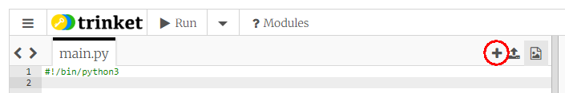
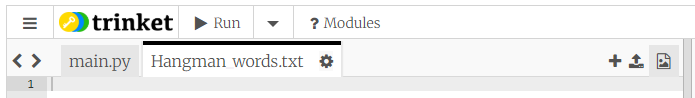
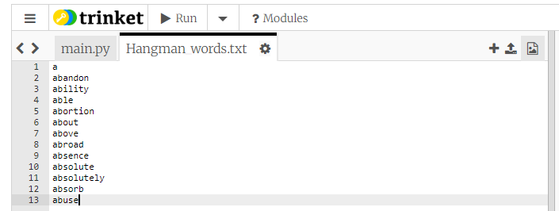

# Adding your own word list to the Hangman game

There is a list of 400 common words in the file called *Hangman_words.txt* in the Hangman project, but what if you wanted to use a larger word list? This sometimes caused a problem, because words from the new list might be in lower case letters, but all the guessing and testing in *Hangman* is set to use CAPITALS. This page will show you how you can use a larger list without causing formatting errors as you run the game.

## A word list where the words are not all in CAPITAL letters

The game is set up for a word list where all the words are in CAPITAL letters. But what if you want to import a list of words from the internet which has words with small letters, or a mixture of capitals and lower case?

The simplest way to use a list like this is to make a slight change to one line of code in the game:

The first bits of code in the game, after making the list of pictures, deal with opening the list of words as a file, reading the contents into Python and converting all the words into a Python *list*. The next line selects one of the list items at random to use as the mystery word. The line that does this is

```python
word_to_guess = choice(wordlist)
```

The change you need to make in order to use a word list in which the words are not all in capitals is this

```python
word_to_guess = choice(wordlist).upper()
```

This will now carry out an additional function after selecting the word at random and before setting the variable ```word_with_guesses``` - namely converting the chosen word to CAPITAL letters. So, it doesn't matter whether the words in the word list are capitals, lower case or a mixture, the variable ```word_to_guess``` will *always* be set to a word which is all CAPITALS. Now you can proceed to guess the mystery word as before.

## Applying some filters to the larger word list

In the original *Hangman_words.txt* word list the words were all selected to make sure they were not too long and not too short (they are all between 6 and 10 letters long), and also that they weren't people's names or brand names, and that they weren't rude words. You can't use Python to check for rude words but you can certainly write some code to filter out words which are too long or too short.

We have already used the Python command to open a file to *read* the contents - now we will use the command to open a file to *write* something to it. This will magically create a new file in your trinket project.

Firstly, start a new trinket project and put in the usual line to make sure trinket will use Python 3 commands:

```python
#!/bin/python3
```

Next, create a new file in your trinket project. Do this by clicking on the **plus** sign at the top right corner of the edit pane:



This will open up a box where you can name your file. I used the name Hangman_words.txt:



(You can't actually see the underscore between Hangman and words, but it is there.)

You can now paste your new wordlist into this new file:



I've only pasted 13 words into my list, so my code will run very quickly. This is a good tactic when you are developing a programme - test it and make sure it works with a small number of datapoints, then when you're sure it's all working you can put in your full set of words.

Now we can use the same code as in the Hangman game to open our new file, read the words into Python, and convert the words into a Python list:

```python
wordfile = open('Hangman_words.txt', 'r')
wordlist = wordfile.read().splitlines()
```

Make sure the name of the new file (in quotes) is exactly the same as the name you gave your file.

The first line here *opens* an existing file, and the bit of code ```'r'``` inside the brackets indicates that we want to **read** from the file. But as we filter our words and decide to keep some and not others we will also need a file to save the words we want to keep. This file doesn't yet exist, but Python will make it for use if we use this code:

```python
filteredwordfile = open('Hangman_words_filtered.txt', 'w')
```

The ```'w'``` inside the brackets indicates that we are going to ***write*** data to this file, and if the file doesn't exist then Python knows it has to create it. We have told Python to name this new file *Hangman_words_filtered.txt*. You won't see the new file immediately - first you will have to write something into it.

### a ```for``` loop to go through all the words

Next we add a ```for``` loop to go through all the words in the list. This will begin something like this:

```python
for word in wordlist:
```

Here ```word``` is just a name for a Python variable - you can use any valid variable name. Whatever the name, this loop will set the variable in turn to every word in the list, which means we can do some tests on the word to see if we want to keep it in our filtered list, or chuck it out. Let's say we only want to keep words which are seven letters long. So each time we go through the loop we need to test the length of the word with an ```if``` statement:

```python
  if len(word) == 7:
```

(Notice that this line has to be indented.)

What do we want to do if the length is equal to 7? Well, we want to write the word into the new *Hangman_words_filtered.txt* file, which is done with this code:

```python
    filteredwordfile.write(word)
```

(Notice that this line is indented *twice*, once for the ```for``` loop, and again for the ```if``` block.)

When you run this code you will see a new file appear beside the original word list - we have used the file ```write()``` method to write a word into the file. But if you look inside the new file you will see that all the seven letter words have been run together on the same line with no gaps.

To fix this we also need to write a *newline* character after each ```word``` that we write to the file. The Python newline character is ```'\n'``` - note this has to be put inside quotes. When we write the variable ```word``` to the new file we are writing a piece of text, so we can use the arithmetic ```+``` sign to add the new line character onto the end of this (because we are allowed to use ```+``` to join text strings together, as well as to add numbers). So change the last line to

```python
    filteredwordfile.write(word + '\n')
```

and now when you run the code you will see all the words on their own line.

Of course, it would be strange to have a word list which only consisted of 7-letter words, so let's find ways to include words within a range of lengths - say from 6 letters to 11 letters. There are lots of ways you can do this (there are *always* lots of different ways of doing something with Python), and they will mostly involve changing the ```if``` line.

#### a Using multiple tests with ```if```

We can use ```if``` to test two different conditions at the same time using the key word ```and```. So to pick out words of length from 6 to 11 we could use:

```python
  if len(word) > 5 and len(word) < 12:
```

This checks the length of the word and writes it to the file if its length is more than 5 AND less than 12.

#### b Using the Python key word ```in```

The key word ```in``` is for checking if an item is in a list or not. It produces an answer which is either ```True``` or ```False``` which is exactly what we need for the Python ```if``` statement. You can try this out in the [Python console](https://trinket.io/console). If you type in the console (don't type the >>>)

```python
>>> 'cat' in ['dog', 'cat', 'rabbit']
```

it will give the answer ```True```, because, obviously, ```'cat'``` is one of the items in the list. If you type

```python
>>> 'elephant' in ['dog', 'cat', 'rabbit']
```

it will give the answer ```False```, because ```elephant``` is not one of the items in the list.

We could use the ```in``` key word in our filtering programme like this:

```python
  if len(word) in [6, 7, 8, 9, 10, 11]:
```

This will select any word that has a length which is one of the numbers in the list. In fact it gives the same result as the last example, but with slightly less typing.

Once you have checked that your code is working with a small list of words you are ready to paste in the full word list, and filter that. But it might take quite a while if your list has a lot of words in it!

[Return to main page](../README.md)
