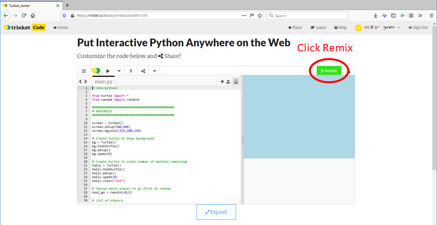

# Remixing a trinket project

1. First you have to be logged in to your trinket account

2. Click on the link to the Trinket project you want to remix. Here is what the screen will look like:

Go back to the main page of [Hangman](../README.md)

