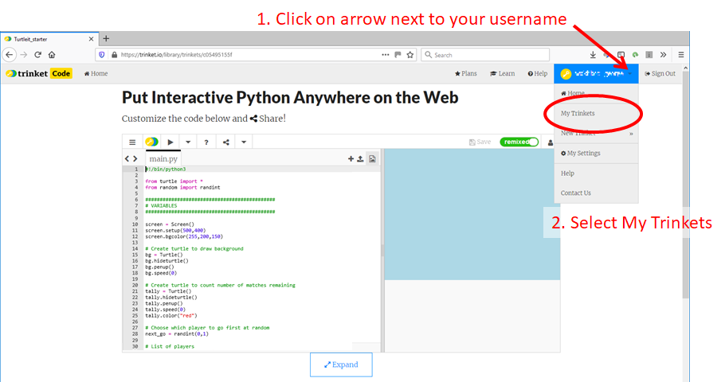

# Remixing a trinket project

Unfortunately when you first remix a trinket project you don't see a button to Save your project. Here is a procedure which will get you to the correct window so you can edit and save your remixed project.

1. First you have to be logged in to your trinket account

2. Click on the weblink to the Trinket project you want to remix. Here is what the screen will look like:

3. Click on the green button labelled Remix - the word in the green button will change to "remixed".

4. Click the down arrow next to the box with your username, then click on the option My Trinkets:

5. You will now see a window which shows all your trinkets. The one you have just remixed will be at the top left.

6. Click on the project you have just remixed:

7. You can now see the Save button. Click on the Save button to save your project. If you want to give it a new name then click on the text after My Trinkets/ and type a new name.

Go back to the main page of [Hangman](../README.md)

