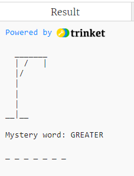

# Choosing the word to guess

In old-fashioned Hangman (before computers) one player would choose a mystery word - which has to be a normal dictionary word, not anyone or anything's name and not slang - and the other player would try to guess it.

In the computer version the computer chooses the word and the player has to try and guess it.

In the starter project, on the left side, you will see two tabs, one labelled ```main.py```, and the other labelled ```Hangman_words.txt```. This tab refers to a computer *file* which has been uploaded to the Trinket project. If you click on this tab you will see a list of 400 words, all in capital letters, which are from six to 10 letters long and fit the rules. We will have the computer select a word at random from this list as the mystery word to guess.

To do this we need to write code to

1. open the ```Hangman_words.txt``` file
2. read all 400 words from the file into a Python list
3. select a word at random from this list as the mystery word

Each of these operations needs a single line of Python code. Put these lines in the *VARIABLES* block of code after the end of the ```pictures``` list.

## 1. Opening the file

In Python we often write code where we need to access some information from another file on the computer, or even a file on the worldwide web. If the file just contains text characters we use the Python function ```open()```, and inside the brackets we put the name of the file, (which must be inside single or double quotes), then a comma,  then the *"mode"* of opening, which means whether we tell Python if we want to read data from the file (mode ```'r'```), or  start writing in a completely new file (mode ```'w'```), or add more data on to the end of an existing file (mode ```'a'```).

We usually link the opened file to a variable which is a *file* type of variable. Because we only want to read from and not write to the file we will use the ```r``` mode. Here is the code for opening the file with a file variable called ```wordfile```. Put this line after the end of the ```pictures``` list in the *VARIABLES* block of the project:

```python
wordfile = open('Hangman_words.txt', 'r')
```

## 2. Reading the words from the file into a Python list

We need to make a **list** variable to hold the list of words. In this example the list variable is called ```wordlist``` but you can choose your own name if you like.

The code for reading the list of words from the file into the list variable looks a bit complicated! It is

```python
wordlist = wordfile.read().splitlines()
```

Put this line after the previous line.

The middle part of this line is ```wordfile.read()``` which *reads* all the words from the file into Python storage, and the bit at the end ```.splitlines()``` means Python puts each line in the file into a different list item.

The beginning of this line ```wordlist =``` simply creates a list variable called ```wordlist``` which will hold all the words as a list. You could add a line of code to *print* this list if you want to see what it looks like.

## 3. Choosing a word at random from the list

Python has a ready-made function for choosing an item at random from a list. The Python function is ```choice()``` where you put the name of the list variable inside the brackets. ```choice()``` is one of the functions contained in the ```random``` library, so if you want to use ```choice()``` in your code you have to ***import*** this library, which means at the top of your code you need to include the line

```python
from random import choice
```

(this should already be in the starter project). 

We will make a variable to hold the random choice, called ```word_to_guess``` in this example. You can choose a different name if you want. Here is the code:

```python
word_to_guess = choice(wordlist)
```

Put this after the lines to open the file and read the words into a list.

---

## Giving away the mystery word

Now we do something which seems a bit silly: we get the computer to display the mystery word. Add this line *as the last line in the project* in the *MAIN CODE* block of the project:

```python
print("\nMystery word: ", word_to_guess)
```

This is obviously silly, as the game is to try and guess this word. However, when we are writing and testing the code it will be very useful to know what the word is, to check if our code works properly. And when the code is all working we will delete this line.

Note the text ```\n``` in the line above - this will print a blank line before displaying the word to guess.

## Displaying the mystery word during the game

As the player guesses letters which might be in the word the computer will display the mystery word with any correctly guessed letters in their correct places, and underscores for letters which haven't been guessed. We need to find a way to write code to do this.

### Displaying the mystery word at the start of the game

At the start of the game none of the letters have been guessed, so we need to display the word with underscore characters for each letter.

How many underscores? Well, this will be the number of letters in the mystery word. We can easily find this out because text strings in Python are a lot like lists, and you probably know that the function for counting the number of items in a list is ```len()```. We can use the same function for counting the number of letters in a text string, so to find the number of letters in a string variable, like ```word_to_guess```, we would use ```len(word_to_guess)```.

If we want a text variable with, say,  eight underscores we can use multiplication! Yes, you can multiply text strings. The code ```'_' * 8``` would produce a text string with eight underscores. But we want to use the number of letters in the mystery word.

Use the previous two paragraphs to help you write a line of Python code which sets a new text variable (I called mine ```word_with_guesses```) equal to the number of underscores in the text variable ```word_to_guess```. Put this line after the previous line.

<details><summary>Click here to see one way to do it</summary>

```python
word_with_guesses = '_' * len(word_to_guess)
```
  
</details>

<p>

### Turning the word with guesses into a list

It would be nice to display the underscores with a space between each, otherwise they would all run together and you wouldn't know how many letters there were. To do this we need to turn our text variable ```word_with_guesses``` into a **list** variable. There is a function to do this called ```list()```.

Put this line of code after the previous line:

```python
word_with_guesses = list(word_with_guesses)
```

### Displaying the word with guesses with spaces

Once we have our word with guesses as a list we can use a special list command for printing a list with spaces between each item. That command is ```' '.join()```. Now we can print our mystery word with underscores and spaces. 

Add this line in the *MAIN CODE* block just *before* the line where we give away the mystery word:

```python
print(' '.join(word_with_guesses))
```

Run your code. Your display should look something like this:



(except, of course, your mystery word will probably be something else, and the number of underscores may also be different).

[Go to Step 3 - Guessing a letter](../step03-guessing_a_letter/STEP3.md)

[Go back to previous page](../step01-list_of_pictures/STEP1.md)
